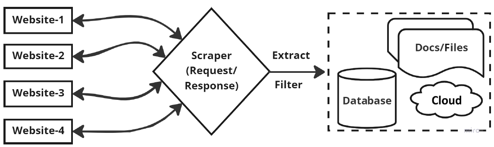

# Web Scraping



**Web scraping** is the automated process of extracting data from websites. This data extraction is typically done by a **web scraper**, which is a program or script designed to navigate websites, locate specific pieces of information, and save them in a structured format (such as CSV, JSON, or databases) for analysis, reporting, or other uses.

## How Web Scraping Works?

Web scraping usually involves the following steps:
1. **Sending HTTP Requests**: The web scraper sends a request (typically HTTP GET) to the target website’s server to access a web page.
    > Hypertext Transfer Protocol (HTTP) is an application protocol that transfers resources (web-based), such as HTML documents, between a client and a web server. HTTP is a stateless protocol that follows the client-server model. Clients (web browsers) and web servers communicate or exchange information using HTTP requests and HTTP responses.
2. **Parsing the HTML**: Once the server responds with the HTML of the page, the scraper parses the HTML to locate specific elements.
3. **Locating and Extracting Data**: Using HTML tags, attributes, and classes (like `<div>`, `<span>`, `class="title"`, etc.), the scraper pinpoints and extracts the relevant data.
4. **Storing the Data**: The extracted data is then organized and stored in a structured format, such as CSV, JSON, or a database.

## Example Use Cases for Web Scraping
- **Price Comparison**: Aggregating product prices from different e-commerce sites.
- **Market Research**: Collecting data on competitors, customer reviews, or trends.
- **Content Aggregation**: Gathering news, articles, or blog posts from multiple sources.
- **Job Listings**: Scraping job listings from various job boards for data analysis.
- **Real Estate Listings**: Extracting property data for analysis or listing on another platform.

## Tools and Libraries for Web Scraping
There are various tools and libraries designed for web scraping, depending on the level of control and the programming language you prefer:
- **Python Libraries**: BeautifulSoup, Scrapy, Selenium (for JavaScript-heavy sites).
- **Dedicated Tools**: Octoparse, ParseHub, or web scraping APIs like ScraperAPI.

## Ethical and Legal Considerations
Web scraping has legal and ethical implications, as some websites have terms of service prohibiting automated access. It's important to:
- **Respect Robots.txt**: Check the website's `robots.txt` file to see what pages allow or disallow scraping.
- **Avoid Overloading Servers**: Set reasonable delays between requests to prevent overwhelming the server.
- **Abide by Terms of Service**: Ensure that your scraping practices comply with the website’s terms of service and applicable laws.

In summary, web scraping is a powerful tool for gathering data automatically from websites. However, it should be done responsibly and ethically to ensure respect for site owners and users.

# Introducing XPath and CSS Selectors to process markup documents

## HTML (HyperText Markup Language) and XML (eXtensible Markup Language) Markup Documents

**HTML** and **XML** are both markup languages used to structure and format data. While they share some similarities in syntax, they are designed with different purposes and use cases in mind.

---

### HTML: HyperText Markup Language

**Purpose**: HTML is the standard markup language used for creating and designing web pages and web applications.

**Key Characteristics**:
- **Fixed Tags**: HTML has a predefined set of tags (like `<div>`, `<p>`, `<a>`, etc.) used to structure content on the web. These tags have specific meanings and are limited in scope.
- **Presentation and Structure**: HTML is focused on the **presentation** of information, meaning that tags define how content is displayed on the web (e.g., `<h1>` for headers, `<p>` for paragraphs).
- **Flexible Syntax**: HTML is more lenient with syntax errors. Web browsers can often handle improperly nested tags and missing closing tags.
- **Attributes**: HTML elements can contain attributes that modify their appearance or behavior, such as `id`, `class`, and `style`.
  
**Example of HTML**:
```html
<!DOCTYPE html>
<html>
<head>
    <title>Sample HTML Document</title>
</head>
<body>
    <h1>Welcome to My Website</h1>
    <p>This is a sample paragraph.</p>
</body>
</html>
```

### XML: eXtensible Markup Language

**Purpose**: XML is a flexible markup language used primarily for **storing** and **transporting** data in a structured format.

**Key Characteristics**:
- **Customizable Tags**: XML allows users to define their own tags, which makes it suitable for data exchange between systems. There are no predefined tags, and XML is entirely customizable.
- **Data Focused**: Unlike HTML, XML is **data-centric**. It does not focus on displaying data but rather on representing it in a way that can be easily understood and transferred across different applications.
- **Strict Syntax**: XML requires strict syntax; every opening tag must have a corresponding closing tag, and tags must be properly nested. This rigidity ensures data consistency.
- **Attributes and Nesting**: XML elements can contain attributes and can be nested to create a hierarchical structure, making it ideal for complex data representation.

**Example of XML**:
```xml
<?xml version="1.0" encoding="UTF-8"?>
<bookstore>
    <book>
        <title>Sample Book Title</title>
        <author>John Doe</author>
        <price currency="USD">29.99</price>
    </book>
</bookstore>
```


### Key Differences Between HTML and XML

| Feature                  | HTML                                                       | XML                                                            |
|--------------------------|------------------------------------------------------------|----------------------------------------------------------------|
| **Purpose**              | Web content and page structure                             | Data storage and transfer                                      |
| **Tag Set**              | Predefined, fixed set of tags                              | Customizable, user-defined tags                                |
| **Syntax Flexibility**   | Flexible, forgiving of minor syntax errors                 | Strict syntax, requires well-formed documents                  |
| **Data Focus**           | Focuses on presentation and display of data                | Focuses on the structure and portability of data               |
| **Usage of Attributes**  | Commonly used to add style and behavior (`id`, `class`)    | Used to store additional data but not commonly for presentation|
| **Data vs. Presentation**| Presentation-oriented                                      | Data-oriented                                                  |


### Use Cases

- **HTML**: Designing web pages, web applications, email templates, and other content to be viewed in browsers.
- **XML**: Data interchange between systems (e.g., REST APIs, SOAP messages), configuration files, document formats (e.g., RSS feeds, SVG files).

In summary, HTML is ideal for content and presentation on the web, while XML is ideal for defining and structuring data for storage and exchange. Both markup languages are essential in web development, though they serve distinct purposes.

## Document Object Model (DOM)

The **Document Object Model (DOM)** is a programming interface for web documents, representing the structure, style, and content of a document in a **tree-like structure**. It allows developers to access, manipulate, and modify the content and structure of HTML and XML documents dynamically. The DOM is a key concept in web development, as it enables interactive and dynamic websites by letting developers update content, style, and behavior of web pages on the fly.

### Key Points About the DOM:
1. **Tree Structure**: The DOM represents the document as a hierarchical tree of nodes, where each node corresponds to a part of the document, such as an HTML element, attribute, or text.
2. **Programming Interface**: Using languages like JavaScript, developers can interact with the DOM to change or retrieve information from the document.
3. **Dynamic and Live**: The DOM is a live representation, meaning that any change made to the DOM is immediately reflected in the visible web page.

### Structure of the DOM

In the DOM tree structure:
- **Document**: The top node represents the entire HTML or XML document.
- **Element Nodes**: Each HTML tag (like `<div>`, `<h1>`, `<p>`, etc.) becomes an element node.
- **Text Nodes**: The actual text within an element is represented as a text node.
- **Attribute Nodes**: Each HTML attribute (like `id`, `class`, `href`, etc.) is represented as an attribute node.

For example, consider the following HTML document:

```html
<!DOCTYPE html>
<html>
<head>
    <title>Sample Page</title>
</head>
<body>
    <h1>Hello, World!</h1>
    <p>This is a sample paragraph.</p>
</body>
</html>
```

The DOM tree for this HTML would look like this:

```
Document
└── html
    ├── head
    │   └── title ("Sample Page")
    └── body
        ├── h1 ("Hello, World!")
        └── p ("This is a sample paragraph.")
```

The DOM is a foundational technology in web development that enables a wide range of functionalities on websites. Through DOM manipulation, developers can create responsive and dynamic web applications that can adjust in real time to user interactions and data updates, providing a more engaging experience for users.

